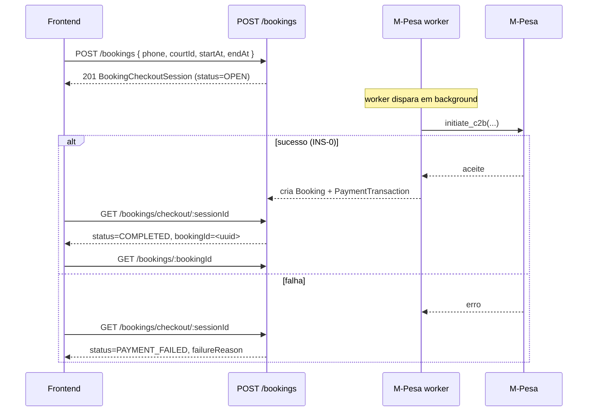

# Prompt para IA do Frontend — Checkout M-Pesa com BookingCheckoutSession

> Substitui completamente o fluxo `booking_manual_payment_confirmation`
> documentado em [front-ai-booking-manual-payment.md](./front-ai-booking-manual-payment.md)
> e o fluxo intermédio descrito em versões anteriores deste mesmo ficheiro.
> A reserva (`Booking`) **deixou de ser criada à entrada**.

## Contexto da mudança

Antes existiam dois passos: o backend criava `Booking PENDING` + `PaymentTransaction PENDING`
e o cliente fazia polling. Agora o backend usa um intermediário — a
**BookingCheckoutSession** — que segura o slot durante o débito M-Pesa. O
`Booking` só nasce **se o pagamento for aceite pelo gateway**. Se falhar,
**não há reserva** — apenas a session marcada como `PAYMENT_FAILED`.



**Regra de negócio:** primeiro paga, depois agenda. Não existe `Booking` num estado pendente — ou existe e está `CONFIRMED`, ou simplesmente não existe.

Provider abstraction no backend: hoje só `MPESA` é suportado; `EMOLA` e `CARD`
ficam para o futuro e são rejeitados com `payment.error.unsupportedMethod`.

---

## O que mudou na API

### Removido (NÃO usar mais)

| Antes | Depois |
| --- | --- |
| `POST /v1/admin/booking/:id/confirm-payment` | **REMOVIDO** — não há confirmação manual |
| Body `{ confirmPaymentNow, method }` em `POST /v1/admin/booking` | **REMOVIDO** |
| `BookingPaymentConfirmRequestDto` | **REMOVIDO** |
| `Booking.status === "PENDING"` resultante de `POST /v1/bookings` | **REMOVIDO** — booking só existe `CONFIRMED` |
| Polling em `GET /v1/bookings/:id` para esperar pagamento | **REMOVIDO** — agora faz-se em `GET /v1/bookings/checkout/:sessionId` |

### Alterado

| Endpoint | Mudança |
| --- | --- |
| `POST /v1/bookings` | Devolve `BookingCheckoutSessionResponseDto` (estado `OPEN`), **não** `BookingResponseDto`. |
| `POST /v1/admin/booking` | Idem. |
| `GET /v1/bookings/checkout/:sessionId` | **NOVO** — polling do estado da session. |
| `GET /v1/admin/booking/checkout/:sessionId` | **NOVO** — admin equivalente. |

---

## Novos contratos

### 1) Iniciar checkout (cliente final)

**Request** `POST /v1/bookings`

```json
{
  "courtId": "uuid",
  "startAt": "2026-05-10T16:00:00.000Z",
  "endAt":   "2026-05-10T17:00:00.000Z",
  "phone":   "258841234567",
  "paymentMethod": "MPESA",
  "participantUserIds": ["uuid"],
  "inviteEmails": ["friend@example.com"]
}
```

- `phone`: **obrigatório**. Aceita `84xxxxxxx`, `+258 84 xxx xxxx`, `25884xxxxxxx`. O backend normaliza para `258XXXXXXXXX`. Operadoras válidas: 82-87.
- `paymentMethod`: opcional (default `MPESA`).
- `participantUserIds` / `inviteEmails`: opcionais. Ficam guardados na session e serão materializados quando o `Booking` nascer.

**Response 201** — `BookingCheckoutSessionResponseDto`:

```json
{
  "id": "session-uuid",
  "status": "OPEN",
  "bookingId": null,
  "organizerId": "user-uuid",
  "courtId": "court-uuid",
  "startAt": "2026-05-10T16:00:00.000Z",
  "endAt":   "2026-05-10T17:00:00.000Z",
  "durationMinutes": 60,
  "amount": 500,
  "currency": "MZN",
  "reference": "PAY-AB12CD34",
  "paymentMethod": "MPESA",
  "phone": "*** 4567",
  "failureReason": null,
  "expiresAt": "2026-05-10T16:30:00.000Z",
  "paidAt": null,
  "completedAt": null,
  "createdAt": "...",
  "updatedAt": "..."
}
```

> **Importante:** o endpoint NÃO espera o M-Pesa terminar. Devolve a session
> imediatamente como `OPEN`. O frontend é responsável por **polling**
> em `GET /v1/bookings/checkout/:sessionId`.

### 2) Iniciar checkout (admin / employee)

`POST /v1/admin/booking` — body idêntico ao público mas com `userId`.
Resposta também é `BookingCheckoutSessionResponseDto`.

O backend dispara automaticamente push + email ao organizador a avisar que
foi criado um checkout em seu nome (`notifyCheckoutCreatedByAdmin`).

### 3) Polling do checkout

`GET /v1/bookings/checkout/:sessionId` (público; admin equivalente em
`GET /v1/admin/booking/checkout/:sessionId`).

Sugere-se polling com backoff:

- intervalo inicial: 3s
- após 30s: 5s
- após 2min: 10s
- desistir após `expiresAt` (server marca como `EXPIRED` via cron)

Estados a observar em `session.status`:

| status | Significado | UX |
| --- | --- | --- |
| `OPEN` | Job ainda na fila | "A iniciar pagamento…" |
| `FINALIZING` | Worker disparou M-Pesa | "Aguarde — confirme no telemóvel com PIN" |
| `COMPLETED` | M-Pesa aceitou. `bookingId` populado | Sucesso. Carregar `GET /bookings/:bookingId` |
| `PAYMENT_FAILED` | M-Pesa recusou. **Não há booking** | Mostrar `failureReason` + retry |
| `EXPIRED` | Cron limpou após `expiresAt` | "Tempo esgotado, tente novamente" |
| `REFUND_PENDING` / `REFUNDED` | Reembolso (não aplicável a este fluxo ainda) | — |

### 4) Carregar o booking final

Quando `session.status === "COMPLETED"`, usar `session.bookingId` para chamar
`GET /v1/bookings/:bookingId`. Esse já é o booking `CONFIRMED` final, com
`participants` materializados e o `PaymentTransaction COMPLETED` correspondente.

---

## Endpoints que continuam iguais

- `GET /v1/bookings/me`
- `GET /v1/bookings/:id` (depois do checkout completar)
- `POST /v1/bookings/:id/cancel`
- `POST /v1/bookings/:id/checkin`
- `GET /v1/admin/booking`
- `GET /v1/admin/booking/:id`
- `POST /v1/admin/booking/:id/cancel`
- `POST /v1/admin/booking/:id/check-in`
- `GET /v1/payments`
- `GET /v1/payments/:id`

---

## Tratamento de erros

### 400 Bad Request

| Mensagem | Causa | UX |
| --- | --- | --- |
| `payment.error.invalidPhone` | Número não é MSISDN moçambicano válido | Marcar campo phone como inválido. |
| `payment.error.unsupportedMethod` | `paymentMethod` ≠ `MPESA` | "Método ainda não suportado". |
| `payment.error.gatewayUnavailable` | Backend sem credenciais ou M-Pesa offline | "Pagamentos temporariamente indisponíveis". |
| `booking.error.conflict` | Slot já tem booking confirmado ou outra session OPEN/FINALIZING | "Esse horário já não está disponível". |

### 404 Not Found

| Mensagem | Causa |
| --- | --- |
| `booking.error.checkoutSessionNotFound` | sessionId desconhecido ou de outro user. |
| `booking.error.notFound` | bookingId desconhecido. |

### Estados intermédios sem erro HTTP

A session ficar `PAYMENT_FAILED` ou `EXPIRED` **não é um erro HTTP**. Tratar
via polling do estado, não por exception.

---

## Fluxos a implementar no frontend

### Fluxo A — App cliente

1. Utilizador seleciona court + horário.
2. Front pede o **número de telemóvel** (default = `user.phone`, editável).
3. `POST /v1/bookings` com `{ courtId, startAt, endAt, phone, paymentMethod: "MPESA" }`.
4. Resposta: `BookingCheckoutSession` com `id` e `status=OPEN`.
5. Mostrar ecrã "Confirme no telemóvel com PIN" com:
   - Spinner / countdown até `expiresAt`
   - Texto: "Foi enviada uma notificação para o número `*** 4567`. Insere o PIN para concluir."
6. Polling de `GET /v1/bookings/checkout/:sessionId` a cada 3-5s.
7. Resolver para um de:
   - `status=COMPLETED` → carregar `GET /bookings/:bookingId`, ecrã de sucesso.
   - `status=PAYMENT_FAILED` → ecrã de falha com `failureReason` + botão "Tentar de novo".
   - `status=EXPIRED` → "Tempo esgotado, vamos tentar de novo?".
   - timeout do polling → "Demorou mais que o esperado, verifica em Minhas Reservas".

### Fluxo B — Painel admin/employee

1. Admin abre "Nova Reserva".
2. Seleciona utilizador, court, horário.
3. Preenche **número de telemóvel** do cliente (obrigatório).
4. `POST /v1/admin/booking` com `{ userId, courtId, startAt, endAt, phone, paymentMethod: "MPESA" }`.
5. Resposta: session OPEN. Mostrar lista do estado:
   - badge `OPEN` (cinza) → "A iniciar"
   - badge `FINALIZING` (azul) → "Cliente a confirmar"
   - badge `COMPLETED` (verde) → "Pago"
   - badge `PAYMENT_FAILED` (vermelho) → "Falhou: <failureReason>"
   - badge `EXPIRED` (cinza) → "Expirou"
6. Polling com `GET /v1/admin/booking/checkout/:sessionId`.

### Fluxo C — Sessions antigas

Sessions OPEN/FINALIZING cuja `expiresAt` já passou são marcadas
automaticamente como `EXPIRED` por um cron a cada minuto. O front não
precisa fazer nada especial.

---

## Componentes UI a criar/atualizar

- **Input de telemóvel moçambicano**: máscara `+258 8X XXX XXXX`, validação client-side com regex `^\+?258\s?8[2-7]\s?\d{3}\s?\d{4}$|^8[2-7]\d{7}$`.
- **Badge de `BookingCheckoutSessionStatus`** com os 5 valores principais (`OPEN`, `FINALIZING`, `COMPLETED`, `PAYMENT_FAILED`, `EXPIRED`).
- **Modal "Aguardando pagamento M-Pesa"** com countdown até `expiresAt` e instrução para inserir o PIN.
- **Tela de falha** que renderiza `failureReason` e oferece retry (refazer o `POST /v1/bookings`).

---

## Mutations / queries (React Query)

### Removidas

- ~~`useConfirmBookingPaymentMutation`~~ — endpoint deixou de existir.
- ~~`useBookingPollingQuery(bookingId)`~~ — substituída por `useCheckoutPollingQuery(sessionId)`.

### Adicionadas/alteradas

- `useCreateBookingMutation()` → devolve `BookingCheckoutSession`.
- `useCreateAdminBookingMutation()` → devolve `BookingCheckoutSession`.
- `useCheckoutPollingQuery(sessionId)` → hook dedicado para polling enquanto a session está em `OPEN`/`FINALIZING`. Para quando o estado é terminal (`COMPLETED`, `PAYMENT_FAILED`, `EXPIRED`).
- Quando `status === COMPLETED`, invalidar `booking-details:{bookingId}` e `my-bookings`.

### Invalidação após sucesso

- `my-bookings`
- `admin-bookings` (se aplicável)
- `booking-details:{bookingId}` (depois de obter o `bookingId` da session)

---

## Critérios de aceite

- Nenhuma chamada a `POST /v1/admin/booking/:id/confirm-payment` em produção.
- O input de telemóvel é obrigatório em **ambos** os formulários e valida operadora moçambicana.
- O front trata `OPEN` e `FINALIZING` com UX explícita ("confirme com PIN no telemóvel").
- Quando o pagamento falha, o utilizador vê o `failureReason` e tem opção de retry (criar nova session).
- O ecrã de sucesso só aparece depois de `session.status === "COMPLETED"` e do `GET /bookings/:bookingId` resolver com sucesso.
- Sessions `EXPIRED`/`PAYMENT_FAILED` não geram nenhum `Booking` no painel (não existem na tabela).
